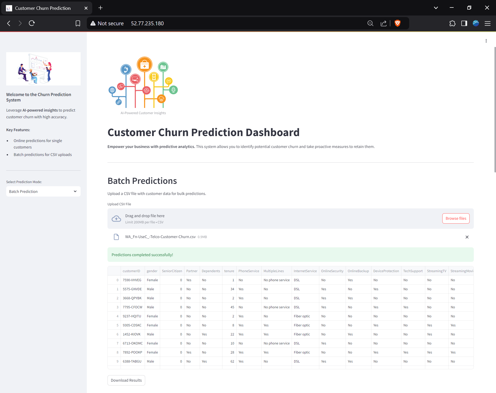

<h1><center>Customer Churn Analysis</h1>



A Customer Churn Analysis website made using Streamlit for Final Year Project

## Table of Contents

1. [Project Overview](#project-overview)  
2. [Dataset](#dataset)  
3. [Project Structure](#project-structure)  
4. [Getting Started](#getting-started)
    - [Prerequisites](#prerequisites)
    - [Installation](#installation)
5. [Model Training](#model-training)
6. [Running the Streamlit App](#running-the-streamlit-app)
    - [Online (Single) Prediction](#online-single-prediction)
    - [Batch Prediction](#batch-prediction)
7. [Docker Usage](#docker-usage)
8. [Deployment on AWS EC2 (Ubuntu)](#deployment-on-aws-ec2-ubuntu)
9. [Key Files](#key-files)
10. [Future Enhancements](#future-enhancements)
11. [License](#license)

---

## Project Overview

Most businesses want to reduce **customer churn**, as retaining existing customers is often more cost-effective than acquiring new ones. By using machine learning techniques on a telco customer dataset, this project aims to:

- Analyze factors that contribute to churn.
- Build a predictive model to identify at-risk customers.
- Enable quick churn predictions through a user-friendly web application.

This repository contains a complete end-to-end project for **Customer Churn Analysis**. It demonstrates data ingestion, exploratory data analysis, model development (using Logistic Regression), evaluation, deployment through a Streamlit-based web application and deployment in a Docker container on AWS EC2. The primary goal is to predict the likelihood of customer churn (i.e., whether a customer will discontinue the service).

---

## Dataset

The project uses the [Telco Customer Churn dataset](https://www.kaggle.com/blastchar/telco-customer-churn). It includes various demographic, account, and service usage features (e.g., customer tenure, monthly charges, contract type, etc.).  

**Key attributes include:**
- `gender` (male, female)
- `seniorcitizen`
- `partner`
- `dependents`
- `tenure`
- `phoneservice`
- `multiplelines`
- `internetservice`
- `onlinesecurity`
- `onlinebackup`
- `deviceprotection`
- `techsupport`
- `streamingtv`
- `streamingmovies`
- `contract`
- `paperlessbilling`
- `paymentmethod`
- `monthlycharges`
- `totalcharges`
- `churn` (target variable: yes/no)

---

## Project Structure

```📁
.
├── 📁 AWS Deployment                   # AWS Deployment images and script to automate deployment
├── 📁 Dataset                          # Telco Customer Churn dataset
├── Churn_EDA_model_development.ipynb   # Exploratory Data Analysis (EDA) Notebook
├── Churn_model_metrics.ipynb           # Additional metrics and experimentation
├── Churn_Visualization.ipynb           # Dataset visualization
├── Dockerfile                          # Docker setup for containerization
├── train.py                            # Script for training the Logistic Regression model
├── stream_app.py                       # Streamlit app for model deployment
├── model_C=1.0.bin                     # Serialized model artifacts (DictVectorizer + trained model)
├── requirements.txt                    # Python dependencies
└── README.md                           # Project documentation (this file)
```

---

## Getting Started

### Prerequisites

- Python 3.7+  
- [pip](https://pip.pypa.io/en/stable/) 
- [Streamlit](https://streamlit.io/) for interactive dashboards
- Optional: [Docker](https://www.docker.com/) for containerization  

### Installation

1. **Clone the repository**:
   ```bash
   git clone https://github.com/AdityaSuresh013/Customer-Churn-Analysis.git
   cd customer-churn
   ```
2. **Install dependencies**:  
   ```bash
   pip install -r requirements.txt
   ```
   Or manually install the following key libraries:
   ```bash
   pip install pandas numpy scikit-learn scipy streamlit pillow
   ```

---

## Model Training

1. **Prepare your dataset**:  
   - Ensure that `WA_Fn-UseC_-Telco-Customer-Churn.csv` (or whichever CSV you’re using) is in the same folder as `train.py` or specify the correct path in the script.
   - The script expects columns to be lower-case with underscores instead of spaces.

2. **Run `train.py`**:
   ```bash
   python train.py
   ```
   This will:
   - Split the data into training and test sets.
   - Perform k-fold cross-validation using Logistic Regression.
   - Print the AUC score on validation folds and on the final test set.
   - Save the trained model (and `DictVectorizer`) into a file (e.g., `model_C=1.0.bin`).

3. **Check logs and outputs**:  
   - Look for the `auc` outputs in the console to ensure your model is training correctly.
   - A model file (e.g., `model_C=1.0.bin`) should appear in your project directory once training completes.

---

## Running the Streamlit App

The **Streamlit app** (`stream_app.py`) provides a user-friendly interface to make single-customer churn predictions or batch predictions from a CSV file.

1. **Start the app**:
   ```bash
   streamlit run stream_app.py
   # Optionally, run `streamlit run app.py --server.port 80` for port 80
   ```
2. **Navigate to the browser**:  
   By default, Streamlit runs on `http://localhost:8501`. Open it in your browser.

### Online (Single) Prediction

1. In the **left sidebar**, select **"Online Prediction"**.  
2. Enter customer details into the form (e.g., `gender`, `tenure`, `monthlycharges`, etc.).  
3. Click **"Predict Churn"**.  
4. View the predicted **Churn Risk** (“Yes” or “No”) and **Risk Score**.

### Batch Prediction

1. In the **left sidebar**, select **"Batch Prediction"**.
2. **Upload a CSV file** containing multiple customers, ensuring it has the same columns expected by the model (`tenure`, `monthlycharges`, etc.).
3. Wait for the predictions to finish. The app will display a table with a **"Churn Risk"** column and a **"Risk Score"** column for each customer.
4. Optionally, **download** the CSV with predictions.

---

## Docker Usage

If you prefer containerization, you can use the provided `Dockerfile`:

1. **Build the Docker image**:
   ```bash
   sudo docker build -t customer-churn:latest .
   ```
2. **Run the Docker container**:
   ```bash
   sudo docker run -d \
   --name customer-churn
   -p 80:8501 \
   customer-churn:latest
   ```
3. **Access the app**:
   - Open your browser at `http://localhost` or `http://127.0.0.1`

---

## Deployment on AWS EC2 (Ubuntu)

Below is a **high-level overview** of deploying this Dockerized project to an **Ubuntu-based EC2** instance:


1. **Launch an EC2 instance**:
   - Choose **Ubuntu** as the AMI.  
   - Configure your **security group** to allow inbound traffic on ports **22** (SSH) and **80** or **8501** (for the Streamlit app).

2. **SSH into the instance**:
   ```bash
   ssh -i key.pem ubuntu@<ec2-public-ip>
   ```
3. **Install Docker**:
   ```bash
   # Update package index
   sudo apt update
   
   # Install docker.io
   sudo apt install -y docker.io
   
   # Optional: Start and enable Docker
   sudo systemctl start docker
   sudo systemctl enable docker

   # Optional: Add user to Docker group
   sudo /usr/sbin/usermod -aG docker $USER
   ```

   You can verify installation with:
   ```bash
   docker --version
   ```
4. **Clone this repository on the EC2 instance**:
   ```bash
   git clone https://github.com/AdityaSuresh013/Customer-Churn-Analysis.git
   cd Customer-Churn-Analysis
   ```
5. **Build the Docker image on EC2**:
   ```bash
   sudo docker build -t customer-churn:latest .
   ```
6. **Run the Docker container**:
   ```bash
   # Expose port 80 on the host to port 8501 on the container (or adapt to your needs)
   sudo docker run -d \
     --name customer-churn
     -p 80:8501 \
     customer-churn:latest
   ```
   - The `-d` flag runs the container in detached mode.  
   - The `--restart unless-stopped` will ensure the container restarts in case of unexpected shutdown unless stopped by user.
   - If you prefer using port 8501 directly, you can do `-p 8501:8501` and open that port in your AWS Security Group.

7. **Access the application**:
   - In your browser, navigate to `http://<ec2-public-ip>` (if mapped to port 80).  
   - Or `http://<ec2-public-ip>:8501` (if you exposed port 8501).

8. **Check logs**:
   ```bash
   sudo docker ps          # to see running containers
   sudo docker logs customer-churn
   ```
9. **Stopping / removing the container**:
   ```bash
   # List running containers
   sudo docker ps
   
   # Stop a container
   sudo docker stop customer-churn
   
   # Remove a container
   sudo docker rm customer-churn
   ```

### Security Group & Network Configuration

- Make sure the inbound rules in your EC2 Security Group allow HTTP traffic (TCP on port 80) or whichever port your container is using (e.g., 8501).  
- If you’re using a custom domain or HTTPS, you can set up an **Elastic Load Balancer** or **Nginx** proxy in front of your container.

---

## Key Files

- **train.py**  
  Main script that handles data preprocessing, model training, validation, and saving the trained model.

- **stream_app3.py**  
  Streamlit application for interactive churn prediction.  
  - **Online Mode**: Predicts churn for a single customer through form inputs.  
  - **Batch Mode**: Predicts churn for multiple customers in bulk from a CSV file.

- **model_C=1.0.bin**  
  Contains both the `DictVectorizer` (for feature transformation) and the trained Logistic Regression model.

- **Churn_EDA_model_development.ipynb**  
  Jupyter notebook for exploratory data analysis, and initial feature engineering.

- **Churn_model_metrics.ipynb**  
  Jupyter notebook for advanced metrics calculation, model comparisons, or further experiments.

- **Churn_model_metrics.ipynb**  
  Jupyter notebook for dataset visualizations.

- **Dockerfile**  
  Instructions to containerize the application for deployment.

---

## Future Enhancements

1. **Additional Models**: Experiment with Random Forest, Gradient Boosting, or XGBoost for potential performance improvements.  
2. **Automated Hyperparameter Tuning**: Implement tools like GridSearchCV or Optuna.  
3. **CI/CD Pipeline**: Add tests and integrate with GitHub Actions or Jenkins to ensure robust changes.  
4. **Dashboard Improvements**: Add visuals like ROC curve, feature importance charts, or real-time monitoring.
5. **Real-time Data Ingestion**: Hook up streaming data sources for churn predictions.  
6. **Cloud-native Services**: Deploy to AWS App Runner or Kubernetes for more robust scaling.
---

## License

[MIT](https://choosealicense.com/licenses/mit/) © [Aditya S](https://github.com/AdityaSuresh013)
- This project is licensed under the [MIT License](LICENSE) - see the [LICENSE](LICENSE) file for details.  

---
